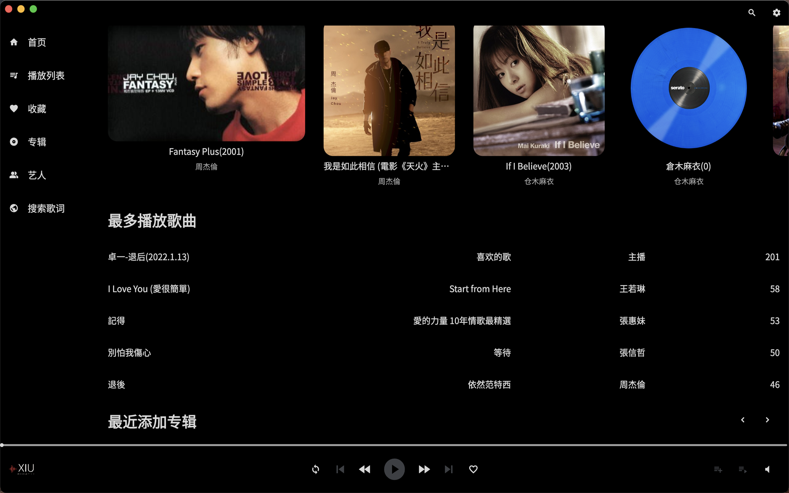

# XiuMusic
      

Based on the personal NAS music player, Navidrome server development, theoretically supports Subsonic server

 🇨🇳[简体中文](README-cn.md) | 🇺🇸[English](README.md)

## Introduction

**Xiu** is [a music anchor](https://www.douyu.com/7884070) that I often watch recently. There is a word Xiu in her name, so she is called **XiuMusic**.

Recently, a lot of things have been set up on the NAS. Among them, the music server uses Navidrome, and the client has chosen a lot, but only [Sonixd](https://github.com/jeffvli/sonixd) feels good, but there is no mobile terminal, and There is a problem of the century, does not support lyrics ([issues](https://github.com/jeffvli/sonixd/issues/332) the author said that there is a big plan to leap to v1.0 and solve the problem of lyrics, and Some current repos support it, but I tried several times without success)

So I need an APP like this:

1. Support lyrics

2. Support fuzzy search (simplified and traditional, this is a big problem, for example, if you search for 周杰伦 and 周杰倫)

3. Concise

4. Unified style of desktop and mobile UI

With these four requirements, I decided to make an APP for myself

This is developed and debugged on the server environment of [Navidrome](https://www.navidrome.org/) based on the interface of [Subsonic API](http://www.subsonic.org/pages/api.jsp) , so in theory it supports Subsonic, Navidrome and Airsonic.

**Notice! ! !** The lyrics are saved in the sqlite at document. Currently, there is no export function. 

**Please use the latest version to pack it yourself. The version on the appstore has logic problems, but I want to improve it a bit before putting it on appstore**





------------------------------

## Quick start

1. Clone project

2. Delete ios and macos to regenerate

3. Execute `flutter create .` in the project directory

4. Execute `flutter packages get` in the project directory

#### MacOS/IOS

The following files are added
DebugProfile.entitlements
Release.entitlements

    <key>com.apple.security.network.client</key>
    <true/>

Turn on lock screen playback
#### IOS
Info.plist
```
<key>UIBackgroundModes</key>
	<array>
		<string>audio</string>
	</array>
```
AndroidManifest.xml

```
<manifest xmlns:tools="http://schemas.android.com/tools" ...>
  <!-- ADD THESE TWO PERMISSIONS -->
  <uses-permission android:name="android.permission.WAKE_LOCK"/>
  <uses-permission android:name="android.permission.FOREGROUND_SERVICE"/>
  
  <application ...>
    
    ...
    
    <!-- EDIT THE android:name ATTRIBUTE IN YOUR EXISTING "ACTIVITY" ELEMENT -->
    <activity android:name="com.ryanheise.audioservice.AudioServiceActivity" ...>
      ...
    </activity>
    
    <!-- ADD THIS "SERVICE" element -->
    <service android:name="com.ryanheise.audioservice.AudioService"
        android:foregroundServiceType="mediaPlayback"
        android:exported="true" tools:ignore="Instantiatable">
      <intent-filter>
        <action android:name="android.media.browse.MediaBrowserService" />
      </intent-filter>
    </service>

    <!-- ADD THIS "RECEIVER" element -->
    <receiver android:name="com.ryanheise.audioservice.MediaButtonReceiver"
        android:exported="true" tools:ignore="Instantiatable">
      <intent-filter>
        <action android:name="android.intent.action.MEDIA_BUTTON" />
      </intent-filter>
    </receiver> 
  </application>
</manifest>
```

#### Use the lyrics search function

You need to set the api of Netease Cloud. According to the instructions of setting [NeteaseCloudMusicApi](https://github.com/Binaryify/NeteaseCloudMusicApi) here, after configuring one on [vercel](https://vercel.com/), set the api The domain name can be used after it is saved in the set lyrics server.


## Dependencies

- [sqflite: ^2.2.25](https://pub.flutter-io.cn/packages/sqflite) data persistence.
- [path: ^1.8.2 ](https://pub.flutter-io.cn/packages/path) Find the location for the database, and it can also be used for image caching, but base64 is still good.
- [just_audio: ^0.9.31](https://pub.dev/packages/just_audio) Music playback tool with 99% praise.
- [just_audio_background: ^0.0.1-beta.9](https://pub.dev/packages/just_audio_background) supports mobile background playback and lock screen control.
- [dio: ^4.0.6](https://pub.dev/packages/dio) and its simple Restful request tool.
- [crypto: ^3.0.2](https://pub.dev/packages/crypto) Used for encryption such as MD5.
- [window_manager: ^0.2.8](https://pub.dev/packages/crypto) It is used to limit the minimization of the form and hide the title bar.
- [flutter_staggered_grid_view: ^0.6.2](https://pub.dev/packages/flutter_staggered_grid_view) Realize waterfall flow, easy to use.
- [cached_network_image: ^3.2.3](https://pub.dev/packages/cached_network_image) implements image caching, easy to use.
- [flutter_lyric: ^2.0.4+6](https://pub.dev/packages/flutter_lyric) There is only one copy on the entire pub, which is easy to use.


## Todo List 

- [x] Debugged: macOS iOS Android
- [ ] Not yet: Windows/Linux should be fine in theory
- [ ] desktop shortcut key
- [ ] tab?
